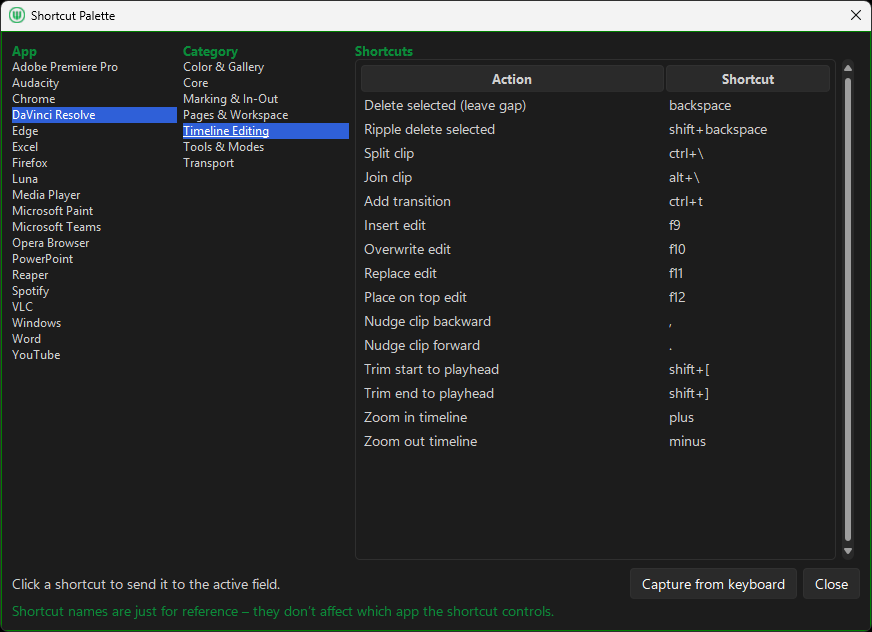
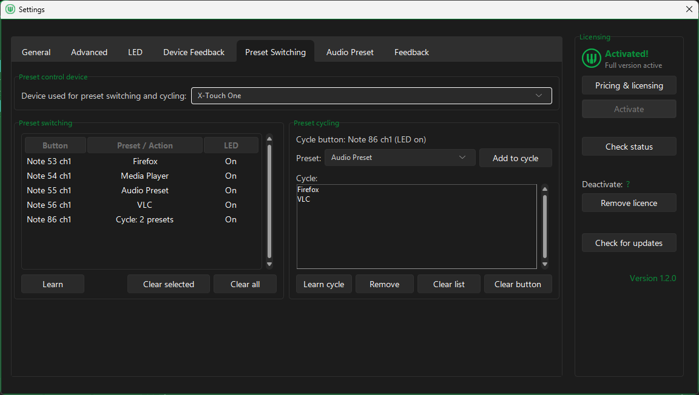

# Getting Started

MIDI Command Studio is a Windows utility for mapping MIDI input to shortcuts, macros, output and input volume controls, soundboard actions, and app-focused workflows.

## Quick Links

- [README](../README.md)
- [Download installer](https://github.com/jpcrowther-cloud/midi-command-studio/releases/download/v1.2.2/MidiCommandStudio_Setup_1.2.2.exe)
- [Website](https://midicommandstudio.com)

## Requirements

- Windows PC
- MIDI controller, keyboard, pad controller, fader bank, knob controller, encoder device, or supported control surface
- MIDI Command Studio installed from the GitHub installer

## From Install To Your First Mapping

1. In the `Devices` panel, add or select your device.
2. Keep the default preset selected or click `New` to create a fresh preset.
3. In the `Mappings` panel, click the `Learn` button that matches the control you want to map.
4. Press or move the control on your MIDI device. The editor opens automatically after the control is detected.
5. In the editor, click a shortcut field such as `On`.
6. Pick a shortcut from the Shortcut Palette, or use `Capture from keyboard` to record your own shortcut.
7. Optional: configure app targeting.
8. Use `Global` to send the shortcut to whatever app is active.
9. Use `Only when app has focus` to send the shortcut only when the selected app is already in the foreground.
10. Use `Force focus` to bring the selected app to the foreground before sending the shortcut. This is useful when working across multiple applications.
11. Click `Save`.

For app targeting, the target application must be running and have an open window so MIDI Command Studio can list it.

## How To Control Windows Volume With A MIDI Controller

Use a MIDI knob or fader for system volume and app-specific volume targets.

Learn a knob, fader, encoder, or jogwheel, set it to a volume action, choose the target volume type, then save.

1. Add your MIDI device.
2. Click `Learn Fader/Knob` or `Learn Encoder/Jogwheel` and move the control you want to use.
3. In the editor, choose a volume mapping type.
4. Choose `System` for master output volume, `App Target` for a specific application's audio session, or `Input` for the Windows default recording input.
5. Save and test by moving the control.

For `App Target` volume, the target app must be running and producing audio so Windows creates an audio session.

For Windows input volume, the mapping controls the Windows recording input level used by apps that follow Windows input controls. Some ASIO, exclusive-mode, or vendor-specific audio paths can bypass Windows input volume and mute controls.

## Preset Switching Reference

Preset switching is configured from settings when you want a MIDI control to change layouts or cycle through selected presets for a device.

## Quick Tips

- If learn does not detect your control, make sure the device row is selected and connected.
- If the wrong learn mode was used, delete that mapping and learn it again with the correct control type.
- If the target app is missing from the app list, open that app first so MIDI Command Studio can see it.
- Use the `Log` window if you are unsure whether a control is sending button, CC, or encoder-style data.

## Next Steps

- Check controller behavior: [Controller Compatibility](controller-compatibility.md)
